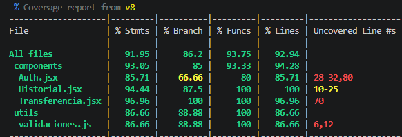

#Mini Banco
React + Firebase · Programación reactiva y manejo de eventos

Prototipo de banca digital con una interfaz simple donde los datos se actualicen en tiempo real.
Se ha implementado una suite de testing unitario para garantizar la robustez de la lógica de negocio y los componentes.

##Uso de IA
Para el desarrollo de este proyecto me apoyé en IA como guía experta. Le pedí ayuda para estructurar la arquitectura de carpetas separando la lógica de Firebase de los componentes. Además, me sirvió para entender cómo corregir errores de navegación en la terminal al levantar el entorno de Vite y para asegurar que la limpieza de suscripciones en los `useEffect` cumpliera con las buenas prácticas exigidas.
En el testing me apoyé en la IA para la configuración inicial del entorno de Vitest + React Testing Library y para entender cómo resolver conflictos de versiones de caché que provocaban el error `Invalid hook call`.

##Instalación y ejecución local
Para probar este proyecto en tu máquina, sigue estos pasos:

1. Clona este repositorio.
2. Crea un archivo llamado `.env` en la raíz del proyecto.
3. Copia el contenido de `.env.example` en tu nuevo archivo `.env` y rellena las variables con las credenciales de tu propio proyecto de Firebase.
4. Abre la terminal en la carpeta del proyecto y ejecuta `npm install` para descargar las dependencias.
5. Ejecuta `npm run dev` para levantar el servidor local.

Los usuarios creados de prueba son:
* **Usuario 1:**
  * Email: n@gmail.com
  * Contraseña: 123456
* **Usuario 2:**
  * Email: d@gmail.com
  * Contraseña: 123456

Modelo de datos en Firestore
* Colección `users/{uid}` -> `{ email, nombre, saldo }`
* Colección `movimientos/{id}` -> `{ emisorUid, receptorUid, emisorEmail, receptorEmail, monto, fecha }`

### Pruebas Unitarias
Este proyecto cuenta con tests unitarios configurados con Vitest y React Testing Library.
* Para correr la suite de pruebas completa, ejecuta: `npm test`
* Para generar y ver el reporte de cobertura, ejecuta: `npm run coverage`

## Refactorización para Testing
Para hacer el código testeable de manera efectiva y cumplir con las buenas prácticas, se extrajo toda la lógica de validación de las transferencias que originalmente vivía dentro del componente `Transferencia.jsx`. Esta lógica se movió a un archivo independiente en `src/utils/validaciones.js` como una función pura, lo que permitió testear de forma exhaustiva casos como montos negativos, saldo insuficiente, destinatario inválido, sin depender del renderizado de React ni de conexiones a Firebase.